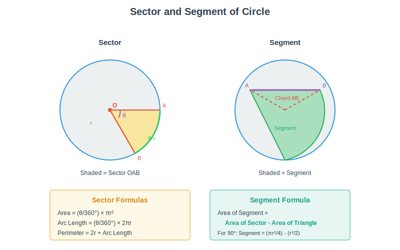
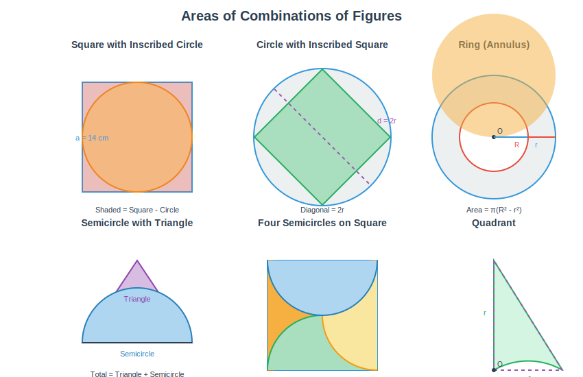
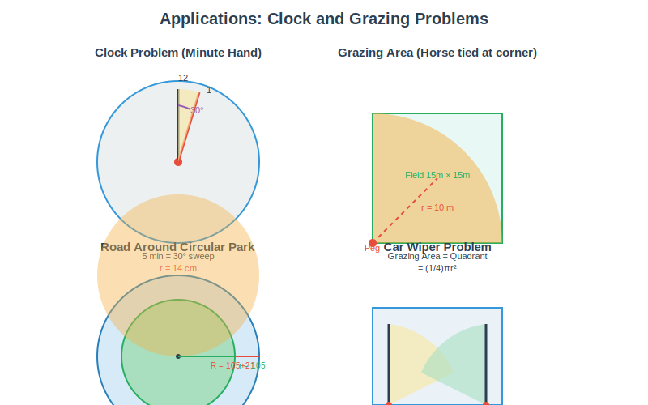

# Areas Related to Circles - Learning Path

## 1. Concept Introduction

### What are Areas Related to Circles?

In this chapter, we learn to find the **areas of regions** that are parts of circles or combinations of circles with other geometric figures.

**Key Concepts:**
- **Perimeter/Circumference** - The boundary length of a circle
- **Area** - The region enclosed by a circle
- **Sector** - A "slice" of a circle (like a pizza slice)
- **Segment** - Region between a chord and an arc
- **Combinations** - Figures made by combining circles with other shapes

**Everyday Examples:**
- 🍕 Pizza slices (sectors)
- 🎯 Dartboard (concentric circles with sectors)
- 🌸 Flower petals (segments)
- 🪙 Coin designs (circular regions)
- 🎨 Rangoli patterns (combinations)
- ⌚ Watch face (circle with sectors)
- 🚗 Steering wheel (circle with segments)

---

### Basic Circle Formulas (Revision):

| Quantity | Formula | Where |
|----------|---------|-------|
| **Circumference** | $C = 2\pi r$ | r = radius |
| **Area** | $A = \pi r^2$ | r = radius |
| **Diameter** | $d = 2r$ | d = diameter |
| **Semi-circle Area** | $A = \frac{1}{2}\pi r^2$ | Half circle |

**Value of π (pi):**
- $\pi \approx \frac{22}{7}$ (for calculations)
- $\pi \approx 3.14$ (approximate)

---

## 2. Micro-topic Breakdown

This chapter is divided into the following key concepts:

```
Areas Related to Circles
├── 2.1 Perimeter and Area of Circle
│   ├── Circumference formula
│   ├── Area formula
│   └── Applications
├── 2.2 Sector of a Circle
│   ├── Definition and parts
│   ├── Perimeter of sector
│   └── Area of sector
├── 2.3 Segment of a Circle
│   ├── Definition
│   ├── Area of segment
│   └── Minor and major segments
└── 2.4 Areas of Combinations
    ├── Circle with triangles
    ├── Circle with squares/rectangles
    └── Shaded region problems
```

---

## 3. Concept Explanations

### 3.1 Perimeter and Area of Circle

#### Circumference of a Circle:

The **circumference** of a circle is the distance around it.

$$ \text{Circumference} = 2\pi r $$

where r = radius of circle

**Example:** If radius = 7 cm
$$ C = 2 \times \frac{22}{7} \times 7 = 44 \text{ cm} $$

---

#### Area of a Circle:

The **area** of a circle is the region enclosed by it.

$$ \text{Area} = \pi r^2 $$

where r = radius of circle

**Example:** If radius = 7 cm
$$ A = \frac{22}{7} \times 7 \times 7 = 154 \text{ cm}^2 $$

---

### 3.2 Sector of a Circle

#### Definition:

A **sector** is the region enclosed by two radii and an arc of a circle.



**Figure: Sector (left) and Segment (right) of a Circle**

The ASCII diagram below shows the basic structure:

```
         A
        / \
       /   \
      /     \
     /       \
    O---------B

    O = Center
    OA, OB = Radii
    Arc AB = Arc
    ∠AOB = Central Angle (θ)
    Shaded region = Sector
```

#### Parts of a Sector:

| Part | Description |
|------|-------------|
| **Radius** | Distance from center to arc (r) |
| **Arc** | Curved part of sector |
| **Central Angle** | Angle at center (θ) |
| **Chord** | Line joining endpoints of arc |

---

#### Perimeter of Sector:

$$ \text{Perimeter} = r + r + \text{Arc Length} $$
$$ \text{Perimeter} = 2r + \text{Arc Length} $$

**Arc Length Formula:**
$$ \text{Arc Length} = \frac{\theta}{360°} \times 2\pi r $$

where θ = central angle in degrees

---

#### Area of Sector:

$$ \text{Area of Sector} = \frac{\theta}{360°} \times \pi r^2 $$

where θ = central angle in degrees

**Derivation:**
- Full circle (360°) has area = πr²
- For angle θ, area = $\frac{\theta}{360°} \times \pi r^2$

**Special Cases:**

| Angle (θ) | Fraction | Area of Sector |
|-----------|----------|----------------|
| 360° | 1 | πr² |
| 180° | 1/2 | $\frac{1}{2}\pi r^2$ (semicircle) |
| 90° | 1/4 | $\frac{1}{4}\pi r^2$ (quadrant) |
| 60° | 1/6 | $\frac{1}{6}\pi r^2$ |
| 45° | 1/8 | $\frac{1}{8}\pi r^2$ |
| 30° | 1/12 | $\frac{1}{12}\pi r^2$ |

---

### 3.3 Segment of a Circle

#### Definition:

A **segment** is the region enclosed between a chord and an arc of a circle.

```
         A ___________ B
          \           /
           \         /
            \       /
             \     /
              \   /
               \ /
                O
             (Center)
    
    Chord AB
    Arc AB
    Shaded region = Segment
```

#### Types of Segments:

| Type | Description |
|------|-------------|
| **Minor Segment** | Smaller region (acute angle) |
| **Major Segment** | Larger region (reflex angle) |

---

#### Area of Segment:

$$ \text{Area of Segment} = \text{Area of Sector} - \text{Area of Triangle} $$

$$ \text{Area of Segment} = \frac{\theta}{360°} \times \pi r^2 - \text{Area of } \Delta OAB $$

**For equilateral triangle (θ = 60°):**
$$ \text{Area of } \Delta = \frac{\sqrt{3}}{4} \times r^2 $$

**For right triangle (θ = 90°):**
$$ \text{Area of } \Delta = \frac{1}{2} \times r \times r = \frac{1}{2}r^2 $$

---

### 3.4 Areas of Combinations of Plane Figures

#### Strategy for Solving:

**Step 1:** Identify the individual figures

**Step 2:** Find areas of each figure

**Step 3:** Add or subtract as per the shaded region

**Step 4:** Write final answer with units



**Figure: Common combinations - Square with Circle, Ring, Semicircle with Triangle, Four Semicircles, Quadrant**

---

#### Common Combination Types:

**Type 1: Circle with Inscribed Square**

```
    ___________
   |     _     |
   |   /   \   |
   |  |     |  |
   |   \___/   |
   |___________|
   
   Shaded = Square - Circle
```

**Type 2: Circle with Circumscribed Square**

```
     _____
    |     |
    |  O  |
    |_____|
    
    Shaded = Circle - Square
```

**Type 3: Semicircle with Triangle**

```
      /\
     /  \
    /____\
   (      )
    
   Total = Triangle + Semicircle
```

**Type 4: Concentric Circles (Ring/Annulus)**

```
    _______
   /   _   \
  |   / \   |
  |  | O |  |
  |   \_/   |
   \_______/
   
   Shaded = Outer - Inner
```

---

## 4. Guided Examples

### Real-World Applications

Before we solve examples, let's understand where these concepts are used:



**Figure: Real-world applications - Clock problems, Grazing areas, Roads around parks, Car wipers**

---

### Example 1: Area of Sector

**Question:** Find the area of a sector of a circle with radius 7 cm and central angle 60°.

**Step-by-Step Solution:**

**Step 1:** Identify given values
- Radius (r) = 7 cm
- Central angle (θ) = 60°

**Step 2:** Apply area of sector formula
$$ \text{Area} = \frac{\theta}{360°} \times \pi r^2 $$

**Step 3:** Substitute values
$$ \text{Area} = \frac{60°}{360°} \times \frac{22}{7} \times 7^2 $$
$$ \text{Area} = \frac{1}{6} \times \frac{22}{7} \times 49 $$
$$ \text{Area} = \frac{1}{6} \times 154 $$
$$ \text{Area} = 25.67 \text{ cm}^2 $$

**Final Answer:** Area of sector = 25.67 cm² (or $\frac{77}{3}$ cm²)

---

### Example 2: Perimeter of Sector

**Question:** Find the perimeter of a sector of a circle of radius 10.5 cm and central angle 120°.

**Step-by-Step Solution:**

**Step 1:** Identify given values
- Radius (r) = 10.5 cm
- Central angle (θ) = 120°

**Step 2:** Find arc length
$$ \text{Arc Length} = \frac{\theta}{360°} \times 2\pi r $$
$$ = \frac{120°}{360°} \times 2 \times \frac{22}{7} \times 10.5 $$
$$ = \frac{1}{3} \times 2 \times \frac{22}{7} \times 10.5 $$
$$ = \frac{1}{3} \times 66 = 22 \text{ cm} $$

**Step 3:** Find perimeter
$$ \text{Perimeter} = 2r + \text{Arc Length} $$
$$ = 2 \times 10.5 + 22 $$
$$ = 21 + 22 = 43 \text{ cm} $$

**Final Answer:** Perimeter of sector = 43 cm

---

### Example 3: Area of Segment

**Question:** A chord of a circle of radius 14 cm subtends an angle of 90° at the center. Find the area of the minor segment.

**Step-by-Step Solution:**

**Step 1:** Identify given values
- Radius (r) = 14 cm
- Central angle (θ) = 90°

**Step 2:** Find area of sector
$$ \text{Area of Sector} = \frac{90°}{360°} \times \frac{22}{7} \times 14^2 $$
$$ = \frac{1}{4} \times \frac{22}{7} \times 196 $$
$$ = \frac{1}{4} \times 616 = 154 \text{ cm}^2 $$

**Step 3:** Find area of triangle
$$ \text{Area of } \Delta = \frac{1}{2} \times r \times r = \frac{1}{2} \times 14 \times 14 = 98 \text{ cm}^2 $$

**Step 4:** Find area of segment
$$ \text{Area of Segment} = 154 - 98 = 56 \text{ cm}^2 $$

**Final Answer:** Area of minor segment = 56 cm²

---

### Example 4: Area of Ring (Annulus)

**Question:** The radii of two concentric circles are 21 cm and 14 cm. Find the area of the ring between them.

**Step-by-Step Solution:**

**Step 1:** Identify given values
- Outer radius (R) = 21 cm
- Inner radius (r) = 14 cm

**Step 2:** Find area of outer circle
$$ A_1 = \pi R^2 = \frac{22}{7} \times 21^2 = \frac{22}{7} \times 441 = 1386 \text{ cm}^2 $$

**Step 3:** Find area of inner circle
$$ A_2 = \pi r^2 = \frac{22}{7} \times 14^2 = \frac{22}{7} \times 196 = 616 \text{ cm}^2 $$

**Step 4:** Find area of ring
$$ \text{Area of Ring} = A_1 - A_2 = 1386 - 616 = 770 \text{ cm}^2 $$

**Alternative Formula:**
$$ \text{Area} = \pi(R^2 - r^2) = \frac{22}{7}(21^2 - 14^2) = \frac{22}{7}(441 - 196) = \frac{22}{7} \times 245 = 770 \text{ cm}^2 $$

**Final Answer:** Area of ring = 770 cm²

---

### Example 5: Combination of Figures

**Question:** In the given figure, ABCD is a square of side 14 cm. Semicircles are drawn on each side of the square as diameter. Find the area of the shaded region.

**Step-by-Step Solution:**

**Step 1:** Analyze the figure
- Square ABCD with side 14 cm
- 4 semicircles on each side
- Shaded region = 4 semicircles

**Step 2:** Find radius of each semicircle
$$ \text{Diameter} = 14 \text{ cm} $$
$$ \text{Radius} = \frac{14}{2} = 7 \text{ cm} $$

**Step 3:** Find area of one semicircle
$$ \text{Area} = \frac{1}{2} \pi r^2 = \frac{1}{2} \times \frac{22}{7} \times 7^2 = \frac{1}{2} \times 154 = 77 \text{ cm}^2 $$

**Step 4:** Find total area of 4 semicircles
$$ \text{Total Area} = 4 \times 77 = 308 \text{ cm}^2 $$

**Final Answer:** Area of shaded region = 308 cm²

---

## 5. Practice Questions

### SECTION A: Multiple Choice Questions (30 Questions - 1 Mark Each)

**Q1.** The area of a circle of radius 7 cm is:
- (A) 44 cm²
- (B) 154 cm²
- (C) 308 cm²
- (D) 616 cm²

<details>
<summary>✓ Show Answer</summary>

**Answer:** (B) 154 cm²

**Explanation:** 
$A = \pi r^2 = \frac{22}{7} \times 7^2 = 154$ cm²
</details>

---

**Q2.** The circumference of a circle of diameter 14 cm is:
- (A) 22 cm
- (B) 44 cm
- (C) 88 cm
- (D) 154 cm

<details>
<summary>✓ Show Answer</summary>

**Answer:** (B) 44 cm

**Explanation:** 
$C = \pi d = \frac{22}{7} \times 14 = 44$ cm
</details>

---

**Q3.** The area of a sector of angle θ (in degrees) of a circle with radius r is:
- (A) $\frac{\theta}{360} \times 2\pi r$
- (B) $\frac{\theta}{360} \times \pi r^2$
- (C) $\frac{\theta}{180} \times \pi r^2$
- (D) $\frac{\theta}{360} \times 2\pi r^2$

<details>
<summary>✓ Show Answer</summary>

**Answer:** (B) $\frac{\theta}{360} \times \pi r^2$

**Explanation:** This is the standard formula for area of sector.
</details>

---

**Q4.** The length of an arc of a sector of angle θ is:
- (A) $\frac{\theta}{360} \times 2\pi r$
- (B) $\frac{\theta}{360} \times \pi r^2$
- (C) $\frac{\theta}{180} \times \pi r$
- (D) $\frac{\theta}{360} \times \pi r$

<details>
<summary>✓ Show Answer</summary>

**Answer:** (A) $\frac{\theta}{360} \times 2\pi r$

**Explanation:** Arc length is fraction of circumference.
</details>

---

**Q5.** The area of a quadrant of a circle of radius 7 cm is:
- (A) 77 cm²
- (B) 38.5 cm²
- (C) 154 cm²
- (D) 19.25 cm²

<details>
<summary>✓ Show Answer</summary>

**Answer:** (B) 38.5 cm²

**Explanation:** 
Quadrant = 1/4 of circle = $\frac{1}{4} \times \frac{22}{7} \times 49 = 38.5$ cm²
</details>

---

**Q6.** If the perimeter of a circle is 44 cm, then its area is:
- (A) 77 cm²
- (B) 154 cm²
- (C) 308 cm²
- (D) 616 cm²

<details>
<summary>✓ Show Answer</summary>

**Answer:** (B) 154 cm²

**Explanation:** 
$2\pi r = 44 \Rightarrow r = 7$ cm
$A = \pi r^2 = 154$ cm²
</details>

---

**Q7.** The area of a semicircle of radius r is:
- (A) $\pi r^2$
- (B) $\frac{1}{2}\pi r^2$
- (C) $\frac{1}{4}\pi r^2$
- (D) $2\pi r^2$

<details>
<summary>✓ Show Answer</summary>

**Answer:** (B) $\frac{1}{2}\pi r^2$

**Explanation:** Semicircle is half of a circle.
</details>

---

**Q8.** The angle of a sector of a circle is 120°. The ratio of the area of this sector to the area of the circle is:
- (A) 1:2
- (B) 1:3
- (C) 1:4
- (D) 2:3

<details>
<summary>✓ Show Answer</summary>

**Answer:** (B) 1:3

**Explanation:** 
$\frac{120°}{360°} = \frac{1}{3}$, so ratio is 1:3
</details>

---

**Q9.** The area of the largest triangle that can be inscribed in a semicircle of radius r is:
- (A) r²
- (B) 2r²
- (C) $\frac{1}{2}r^2$
- (D) $\sqrt{2}r^2$

<details>
<summary>✓ Show Answer</summary>

**Answer:** (A) r²

**Explanation:** 
Base = 2r, Height = r
Area = $\frac{1}{2} \times 2r \times r = r^2$
</details>

---

**Q10.** If the area of a circle is 154 cm², then its radius is:
- (A) 7 cm
- (B) 14 cm
- (C) 21 cm
- (D) 28 cm

<details>
<summary>✓ Show Answer</summary>

**Answer:** (A) 7 cm

**Explanation:** 
$\pi r^2 = 154 \Rightarrow r^2 = 49 \Rightarrow r = 7$ cm
</details>

---

**Q11.** The perimeter of a protractor (semicircle) of radius 7 cm is:
- (A) 22 cm
- (B) 29 cm
- (C) 36 cm
- (D) 44 cm

<details>
<summary>✓ Show Answer</summary>

**Answer:** (C) 36 cm

**Explanation:** 
Perimeter = πr + 2r = 22 + 14 = 36 cm
</details>

---

**Q12.** The area of a sector of a circle of radius 14 cm and angle 45° is:
- (A) 77 cm²
- (B) 154 cm²
- (C) 38.5 cm²
- (D) 19.25 cm²

<details>
<summary>✓ Show Answer</summary>

**Answer:** (A) 77 cm²

**Explanation:** 
$\frac{45°}{360°} \times \frac{22}{7} \times 14^2 = \frac{1}{8} \times 616 = 77$ cm²
</details>

---

**Q13.** The difference between the circumference and radius of a circle is 37 cm. The area of the circle is:
- (A) 154 cm²
- (B) 254 cm²
- (C) 354 cm²
- (D) 454 cm²

<details>
<summary>✓ Show Answer</summary>

**Answer:** (A) 154 cm²

**Explanation:** 
$2\pi r - r = 37 \Rightarrow r(2\pi - 1) = 37$
$r(\frac{44}{7} - 1) = 37 \Rightarrow r = 7$ cm
Area = 154 cm²
</details>

---

**Q14.** The area of a square inscribed in a circle of radius 7 cm is:
- (A) 49 cm²
- (B) 98 cm²
- (C) 147 cm²
- (D) 196 cm²

<details>
<summary>✓ Show Answer</summary>

**Answer:** (B) 98 cm²

**Explanation:** 
Diagonal = 2r = 14 cm
Area = $\frac{1}{2} \times \text{diagonal}^2 = \frac{1}{2} \times 196 = 98$ cm²
</details>

---

**Q15.** If the circumference of a circle increases from 2π to 4π, then its area:
- (A) Remains same
- (B) Doubles
- (C) Triples
- (D) Quadruples

<details>
<summary>✓ Show Answer</summary>

**Answer:** (D) Quadruples

**Explanation:** 
Radius doubles, so area becomes 4 times (area ∝ r²)
</details>

---

**Q16.** The area of the ring between two concentric circles of radii 4 cm and 3 cm is:
- (A) 7π cm²
- (B) 12π cm²
- (C) 25π cm²
- (D) π cm²

<details>
<summary>✓ Show Answer</summary>

**Answer:** (A) 7π cm²

**Explanation:** 
$\pi(4^2 - 3^2) = \pi(16 - 9) = 7\pi$ cm²
</details>

---

**Q17.** The perimeter of a sector of a circle of radius 10 cm and angle 90° is:
- (A) 35.7 cm
- (B) 25.7 cm
- (C) 45.7 cm
- (D) 55.7 cm

<details>
<summary>✓ Show Answer</summary>

**Answer:** (A) 35.7 cm

**Explanation:** 
Arc = $\frac{90}{360} \times 2\pi \times 10 = 15.7$ cm
Perimeter = 10 + 10 + 15.7 = 35.7 cm
</details>

---

**Q18.** The area of a segment of a circle is:
- (A) Area of sector + Area of triangle
- (B) Area of sector - Area of triangle
- (C) Area of triangle - Area of sector
- (D) Area of circle - Area of sector

<details>
<summary>✓ Show Answer</summary>

**Answer:** (B) Area of sector - Area of triangle

**Explanation:** Segment is sector minus the triangle.
</details>

---

**Q19.** If the area of a circle is numerically equal to its circumference, then its radius is:
- (A) 1
- (B) 2
- (C) 3
- (D) 4

<details>
<summary>✓ Show Answer</summary>

**Answer:** (B) 2

**Explanation:** 
$\pi r^2 = 2\pi r \Rightarrow r = 2$
</details>

---

**Q20.** The length of the arc of a sector of angle 60° in a circle of radius 14 cm is:
- (A) $\frac{44}{3}$ cm
- (B) $\frac{88}{3}$ cm
- (C) 44 cm
- (D) 88 cm

<details>
<summary>✓ Show Answer</summary>

**Answer:** (A) $\frac{44}{3}$ cm

**Explanation:** 
$\frac{60}{360} \times 2 \times \frac{22}{7} \times 14 = \frac{1}{6} \times 88 = \frac{44}{3}$ cm
</details>

---

**Q21.** The area of the largest circle that can be drawn inside a rectangle of length 14 cm and breadth 7 cm is:
- (A) 49π cm²
- (B) $\frac{49}{4}\pi$ cm²
- (C) 196π cm²
- (D) 14π cm²

<details>
<summary>✓ Show Answer</summary>

**Answer:** (B) $\frac{49}{4}\pi$ cm²

**Explanation:** 
Diameter = 7 cm (smaller side)
Radius = 3.5 cm
Area = $\pi \times (3.5)^2 = \frac{49}{4}\pi$ cm²
</details>

---

**Q22.** The ratio of the areas of a circle and an equilateral triangle whose diameter and a side are respectively equal is:
- (A) π:√3
- (B) π:3√3
- (C) π:4
- (D) π:3

<details>
<summary>✓ Show Answer</summary>

**Answer:** (A) π:√3

**Explanation:** 
Circle area = $\pi r^2 = \pi (\frac{a}{2})^2 = \frac{\pi a^2}{4}$
Triangle area = $\frac{\sqrt{3}}{4}a^2$
Ratio = π:√3
</details>

---

**Q23.** The perimeter of a square circumscribing a circle of radius a cm is:
- (A) 4a cm
- (B) 8a cm
- (C) 2a cm
- (D) 16a cm

<details>
<summary>✓ Show Answer</summary>

**Answer:** (B) 8a cm

**Explanation:** 
Side of square = 2a
Perimeter = 4 × 2a = 8a cm
</details>

---

**Q24.** The area of the sector of a circle of radius 21 cm and angle 120° is:
- (A) 462 cm²
- (B) 1386 cm²
- (C) 154 cm²
- (D) 308 cm²

<details>
<summary>✓ Show Answer</summary>

**Answer:** (A) 462 cm²

**Explanation:** 
$\frac{120}{360} \times \frac{22}{7} \times 21^2 = \frac{1}{3} \times 1386 = 462$ cm²
</details>

---

**Q25.** If the radius of a circle is increased by 100%, the area is increased by:
- (A) 100%
- (B) 200%
- (C) 300%
- (D) 400%

<details>
<summary>✓ Show Answer</summary>

**Answer:** (C) 300%

**Explanation:** 
New radius = 2r
New area = 4πr²
Increase = 3πr² = 300%
</details>

---

**Q26.** The area of the incircle of an equilateral triangle of side 42 cm is:
- (A) 22π cm²
- (B) 49π cm²
- (C) 196π cm²
- (D) 147π cm²

<details>
<summary>✓ Show Answer</summary>

**Answer:** (B) 49π cm²

**Explanation:** 
Inradius = $\frac{a}{2\sqrt{3}} = \frac{42}{2\sqrt{3}} = 7\sqrt{3}$ cm
Wait, r = $\frac{a\sqrt{3}}{6} = 7\sqrt{3}$ cm
Area = $\pi \times (7\sqrt{3})^2 = 147\pi$ cm²

**Correction:** Answer is (D) 147π cm²
</details>

---

**Q27.** The area of a circle inscribed in a square of side 14 cm is:
- (A) 49π cm²
- (B) 196π cm²
- (C) 98π cm²
- (D) 14π cm²

<details>
<summary>✓ Show Answer</summary>

**Answer:** (A) 49π cm²

**Explanation:** 
Diameter = 14 cm, so r = 7 cm
Area = π × 7² = 49π cm²
</details>

---

**Q28.** The perimeter of a semicircular protractor of diameter 14 cm is:
- (A) 22 cm
- (B) 36 cm
- (C) 44 cm
- (D) 50 cm

<details>
<summary>✓ Show Answer</summary>

**Answer:** (B) 36 cm

**Explanation:** 
Perimeter = πr + 2r = 22 + 14 = 36 cm
</details>

---

**Q29.** The area of the minor segment of a circle of radius 14 cm when a chord subtends 90° at center is:
- (A) 56 cm²
- (B) 112 cm²
- (C) 154 cm²
- (D) 98 cm²

<details>
<summary>✓ Show Answer</summary>

**Answer:** (A) 56 cm²

**Explanation:** 
Sector area = $\frac{1}{4} \times \frac{22}{7} \times 196 = 154$ cm²
Triangle area = $\frac{1}{2} \times 14 \times 14 = 98$ cm²
Segment = 154 - 98 = 56 cm²
</details>

---

**Q30.** The radius of a circle whose area is equal to the sum of areas of two circles of radii 24 cm and 7 cm is:
- (A) 17 cm
- (B) 25 cm
- (C) 31 cm
- (D) 35 cm

<details>
<summary>✓ Show Answer</summary>

**Answer:** (B) 25 cm

**Explanation:** 
$\pi R^2 = \pi(24^2 + 7^2) = \pi(576 + 49) = \pi \times 625$
$R = 25$ cm
</details>

---

### SECTION B: Short Answer Questions (20 Questions - 2-3 Marks Each)

**Q31.** Find the area of a sector of a circle with radius 6 cm and central angle 60°.

<details>
<summary>✓ Show Answer</summary>

**Answer:**

Given: r = 6 cm, θ = 60°

$$ \text{Area} = \frac{\theta}{360°} \times \pi r^2 $$
$$ = \frac{60}{360} \times \frac{22}{7} \times 6^2 $$
$$ = \frac{1}{6} \times \frac{22}{7} \times 36 $$
$$ = \frac{132}{7} = 18.86 \text{ cm}^2 $$

**Answer:** 18.86 cm² (or $\frac{132}{7}$ cm²)
</details>

---

**Q32.** Find the circumference of a circle whose area is 154 cm².

<details>
<summary>✓ Show Answer</summary>

**Answer:**

Given: Area = 154 cm²

$$ \pi r^2 = 154 $$
$$ \frac{22}{7} \times r^2 = 154 $$
$$ r^2 = 49 $$
$$ r = 7 \text{ cm} $$

Circumference:
$$ C = 2\pi r = 2 \times \frac{22}{7} \times 7 = 44 \text{ cm} $$

**Answer:** 44 cm
</details>

---

**Q33.** The perimeter of a sector of a circle of radius 5.6 cm is 27.2 cm. Find the area of the sector.

<details>
<summary>✓ Show Answer</summary>

**Answer:**

Given: r = 5.6 cm, Perimeter = 27.2 cm

Perimeter = 2r + Arc length
$$ 27.2 = 2 \times 5.6 + \text{Arc} $$
$$ \text{Arc} = 27.2 - 11.2 = 16 \text{ cm} $$

Area of sector:
$$ A = \frac{1}{2} \times \text{Arc} \times r = \frac{1}{2} \times 16 \times 5.6 = 44.8 \text{ cm}^2 $$

**Answer:** 44.8 cm²
</details>

---

**Q34.** A chord of a circle of radius 10 cm subtends a right angle at the center. Find the area of the minor segment.

<details>
<summary>✓ Show Answer</summary>

**Answer:**

Given: r = 10 cm, θ = 90°

Area of sector:
$$ \frac{90}{360} \times 3.14 \times 10^2 = \frac{1}{4} \times 314 = 78.5 \text{ cm}^2 $$

Area of triangle:
$$ \frac{1}{2} \times 10 \times 10 = 50 \text{ cm}^2 $$

Area of segment:
$$ 78.5 - 50 = 28.5 \text{ cm}^2 $$

**Answer:** 28.5 cm²
</details>

---

**Q35.** Find the area of a quadrant of a circle whose circumference is 22 cm.

<details>
<summary>✓ Show Answer</summary>

**Answer:**

Given: Circumference = 22 cm

$$ 2\pi r = 22 $$
$$ r = \frac{22 \times 7}{2 \times 22} = 3.5 \text{ cm} $$

Area of quadrant:
$$ \frac{1}{4} \times \frac{22}{7} \times (3.5)^2 = \frac{1}{4} \times 38.5 = 9.625 \text{ cm}^2 $$

**Answer:** 9.625 cm²
</details>

---

**Q36.** The length of the minute hand of a clock is 14 cm. Find the area swept by the minute hand in 5 minutes.

<details>
<summary>✓ Show Answer</summary>

**Answer:**

In 5 minutes, angle swept = 30° (6° per minute)

Given: r = 14 cm, θ = 30°

Area of sector:
$$ \frac{30}{360} \times \frac{22}{7} \times 14^2 $$
$$ = \frac{1}{12} \times 616 = 51.33 \text{ cm}^2 $$

**Answer:** 51.33 cm² (or $\frac{154}{3}$ cm²)
</details>

---

**Q37.** Find the area of the shaded region if ABCD is a square of side 14 cm and four semicircles are drawn on each side.

<details>
<summary>✓ Show Answer</summary>

**Answer:**

Side of square = 14 cm
Radius of each semicircle = 7 cm

Area of one semicircle:
$$ \frac{1}{2} \times \frac{22}{7} \times 7^2 = 77 \text{ cm}^2 $$

Area of 4 semicircles:
$$ 4 \times 77 = 308 \text{ cm}^2 $$

**Answer:** 308 cm²
</details>

---

**Q38.** The radii of two concentric circles are 7 cm and 14 cm. Find the area of the ring between them.

<details>
<summary>✓ Show Answer</summary>

**Answer:**

Given: R = 14 cm, r = 7 cm

Area of ring:
$$ \pi(R^2 - r^2) = \frac{22}{7}(14^2 - 7^2) $$
$$ = \frac{22}{7}(196 - 49) = \frac{22}{7} \times 147 = 462 \text{ cm}^2 $$

**Answer:** 462 cm²
</details>

---

**Q39.** A horse is tied to a peg at one corner of a square field of side 15 m by means of a rope of length 10 m. Find the area of the field in which the horse can graze.

<details>
<summary>✓ Show Answer</summary>

**Answer:**

The horse can graze in a quadrant of radius 10 m.

Area of quadrant:
$$ \frac{1}{4} \times 3.14 \times 10^2 = \frac{1}{4} \times 314 = 78.5 \text{ m}^2 $$

**Answer:** 78.5 m²
</details>

---

**Q40.** Find the area of a sector of a circle of radius 21 cm and central angle 120°.

<details>
<summary>✓ Show Answer</summary>

**Answer:**

Given: r = 21 cm, θ = 120°

$$ \text{Area} = \frac{120}{360} \times \frac{22}{7} \times 21^2 $$
$$ = \frac{1}{3} \times \frac{22}{7} \times 441 $$
$$ = \frac{1}{3} \times 1386 = 462 \text{ cm}^2 $$

**Answer:** 462 cm²
</details>

---

**Q41.** A chord of a circle of radius 12 cm subtends an angle of 120° at the center. Find the area of the corresponding segment.

<details>
<summary>✓ Show Answer</summary>

**Answer:**

Given: r = 12 cm, θ = 120°

Area of sector:
$$ \frac{120}{360} \times 3.14 \times 12^2 = \frac{1}{3} \times 452.16 = 150.72 \text{ cm}^2 $$

Area of triangle:
$$ \frac{1}{2} \times 12 \times 12 \times \sin 120° = 72 \times 0.866 = 62.35 \text{ cm}^2 $$

Area of segment:
$$ 150.72 - 62.35 = 88.37 \text{ cm}^2 $$

**Answer:** 88.37 cm²
</details>

---

**Q42.** A car has two wipers which do not overlap. Each wiper has a blade of length 25 cm sweeping through an angle of 115°. Find the total area cleaned at each sweep.

<details>
<summary>✓ Show Answer</summary>

**Answer:**

Given: r = 25 cm, θ = 115°

Area of one sector:
$$ \frac{115}{360} \times \frac{22}{7} \times 25^2 = 0.3194 \times 1964.29 = 627.48 \text{ cm}^2 $$

Total area (2 wipers):
$$ 2 \times 627.48 = 1254.96 \text{ cm}^2 $$

**Answer:** 1254.96 cm²
</details>

---

**Q43.** Find the area of the largest square that can be inscribed in a circle of radius 7 cm.

<details>
<summary>✓ Show Answer</summary>

**Answer:**

Diameter of circle = 14 cm = Diagonal of square

Area of square:
$$ \frac{1}{2} \times \text{diagonal}^2 = \frac{1}{2} \times 14^2 = \frac{1}{2} \times 196 = 98 \text{ cm}^2 $$

**Answer:** 98 cm²
</details>

---

**Q44.** The area of an equilateral triangle is 49√3 cm². Taking each angular point as center, a circle is described with radius equal to half the length of the side of the triangle. Find the area not included in the circles.

<details>
<summary>✓ Show Answer</summary>

**Answer:**

Area of triangle = 49√3 cm²

$$ \frac{\sqrt{3}}{4}a^2 = 49\sqrt{3} $$
$$ a^2 = 196 \Rightarrow a = 14 \text{ cm} $$

Radius of each circle = 7 cm

Area of 3 sectors (each 60°):
$$ 3 \times \frac{60}{360} \times \frac{22}{7} \times 7^2 = \frac{1}{2} \times 154 = 77 \text{ cm}^2 $$

Area not included:
$$ 49\sqrt{3} - 77 = 84.87 - 77 = 7.87 \text{ cm}^2 $$

**Answer:** 7.87 cm²
</details>

---

**Q45.** A circular pond is of diameter 17.5 m. It is surrounded by a 2 m wide path. Find the cost of constructing the path at the rate of ₹25 per m².

<details>
<summary>✓ Show Answer</summary>

**Answer:**

Radius of pond: r = 8.75 m
Radius of outer circle: R = 8.75 + 2 = 10.75 m

Area of path:
$$ \pi(R^2 - r^2) = \frac{22}{7}(10.75^2 - 8.75^2) $$
$$ = \frac{22}{7}(115.56 - 76.56) = \frac{22}{7} \times 39 = 122.57 \text{ m}^2 $$

Cost:
$$ 122.57 \times 25 = ₹3064.25 $$

**Answer:** ₹3064.25
</details>

---

**Q46.** In a circle of radius 21 cm, an arc subtends an angle of 60° at the center. Find the length of the arc.

<details>
<summary>✓ Show Answer</summary>

**Answer:**

Given: r = 21 cm, θ = 60°

Arc length:
$$ \frac{60}{360} \times 2 \times \frac{22}{7} \times 21 $$
$$ = \frac{1}{6} \times 132 = 22 \text{ cm} $$

**Answer:** 22 cm
</details>

---

**Q47.** A brooch is made with silver wire in the form of a circle with diameter 35 mm. The wire is also used in making 5 diameters which divide the circle into 10 equal sectors. Find the total length of silver wire required.

<details>
<summary>✓ Show Answer</summary>

**Answer:**

Diameter = 35 mm, Radius = 17.5 mm

Circumference:
$$ 2\pi r = 2 \times \frac{22}{7} \times 17.5 = 110 \text{ mm} $$

Length of 5 diameters:
$$ 5 \times 35 = 175 \text{ mm} $$

Total length:
$$ 110 + 175 = 285 \text{ mm} $$

**Answer:** 285 mm
</details>

---

**Q48.** Find the area of the shaded region if PQRS is a square of side 20 cm and semicircles are drawn on each side.

<details>
<summary>✓ Show Answer</summary>

**Answer:**

Side = 20 cm, Radius = 10 cm

Area of square:
$$ 20^2 = 400 \text{ cm}^2 $$

Area of 4 semicircles (2 full circles):
$$ 2 \times \pi \times 10^2 = 2 \times 314 = 628 \text{ cm}^2 $$

Total area:
$$ 400 + 628 = 1028 \text{ cm}^2 $$

**Answer:** 1028 cm²
</details>

---

**Q49.** The area of a circle inscribed in an equilateral triangle is 154 cm². Find the perimeter of the triangle.

<details>
<summary>✓ Show Answer</summary>

**Answer:**

Given: Area of incircle = 154 cm²

$$ \pi r^2 = 154 \Rightarrow r = 7 \text{ cm} $$

For equilateral triangle:
$$ r = \frac{a\sqrt{3}}{6} $$
$$ 7 = \frac{a\sqrt{3}}{6} \Rightarrow a = \frac{42}{\sqrt{3}} = 14\sqrt{3} \text{ cm} $$

Perimeter:
$$ 3a = 3 \times 14\sqrt{3} = 42\sqrt{3} \text{ cm} $$

**Answer:** 42√3 cm
</details>

---

**Q50.** Find the area of the region between two concentric circles if the outer circle has radius 21 cm and the inner circle has radius 14 cm.

<details>
<summary>✓ Show Answer</summary>

**Answer:**

Given: R = 21 cm, r = 14 cm

Area of ring:
$$ \pi(R^2 - r^2) = \frac{22}{7}(21^2 - 14^2) $$
$$ = \frac{22}{7}(441 - 196) = \frac{22}{7} \times 245 = 770 \text{ cm}^2 $$

**Answer:** 770 cm²
</details>

---

### SECTION C: Long Answer Questions (15 Questions - 5 Marks Each)

**Q51.** (a) Find the area of a sector of a circle with radius 12 cm and central angle 120°.
(b) Find the length of the corresponding arc.
(c) Find the area of the segment formed by the corresponding chord.

<details>
<summary>✓ Show Answer</summary>

**Answer:**

**(a) Area of sector:**

Given: r = 12 cm, θ = 120°

$$ \text{Area} = \frac{120}{360} \times 3.14 \times 12^2 $$
$$ = \frac{1}{3} \times 3.14 \times 144 = 150.72 \text{ cm}^2 $$

**(b) Arc length:**

$$ \text{Arc} = \frac{120}{360} \times 2 \times 3.14 \times 12 $$
$$ = \frac{1}{3} \times 75.36 = 25.12 \text{ cm} $$

**(c) Area of segment:**

Area of triangle:
$$ \frac{1}{2} \times 12 \times 12 \times \sin 120° = 72 \times 0.866 = 62.35 \text{ cm}^2 $$

Area of segment:
$$ 150.72 - 62.35 = 88.37 \text{ cm}^2 $$

**Answers:**
- (a) 150.72 cm²
- (b) 25.12 cm
- (c) 88.37 cm²
</details>

---

**Q52.** (a) A square OABC is inscribed in a quadrant OPBQ. If OA = 20 cm, find the area of the shaded region.
(b) Find the perimeter of the shaded region.
(c) What percentage of the quadrant's area is the square?

<details>
<summary>✓ Show Answer</summary>

**Answer:**

**(a) Area of shaded region:**

Side of square = 20 cm
Diagonal = Radius = $20\sqrt{2}$ cm

Area of quadrant:
$$ \frac{1}{4} \times 3.14 \times (20\sqrt{2})^2 = \frac{1}{4} \times 3.14 \times 800 = 628 \text{ cm}^2 $$

Area of square:
$$ 20^2 = 400 \text{ cm}^2 $$

Shaded area:
$$ 628 - 400 = 228 \text{ cm}^2 $$

**(b) Perimeter of shaded region:**

Arc length:
$$ \frac{1}{4} \times 2 \times 3.14 \times 20\sqrt{2} = 44.4 \text{ cm} $$

Perimeter:
$$ 44.4 + 20 + 20 = 84.4 \text{ cm} $$

**(c) Percentage:**

$$ \frac{400}{628} \times 100 = 63.69\% $$

**Answers:**
- (a) 228 cm²
- (b) 84.4 cm
- (c) 63.69%
</details>

---

**Q53.** (a) Find the area of the shaded region if ABCD is a rectangle of dimensions 20 cm × 14 cm and a semicircle is cut off on each shorter side.
(b) Find the perimeter of the remaining portion.
(c) If the cost of painting is ₹2 per cm², find the total cost.

<details>
<summary>✓ Show Answer</summary>

**Answer:**

**(a) Area of shaded region:**

Area of rectangle:
$$ 20 \times 14 = 280 \text{ cm}^2 $$

Radius of semicircle = 7 cm

Area of 2 semicircles:
$$ \pi \times 7^2 = \frac{22}{7} \times 49 = 154 \text{ cm}^2 $$

Shaded area:
$$ 280 - 154 = 126 \text{ cm}^2 $$

**(b) Perimeter:**

$$ 20 + 20 + \pi \times 7 = 40 + 22 = 62 \text{ cm} $$

**(c) Cost of painting:**

$$ 126 \times 2 = ₹252 $$

**Answers:**
- (a) 126 cm²
- (b) 62 cm
- (c) ₹252
</details>

---

**Q54.** (a) Three horses are tethered at 3 corners of a triangular field having sides 20 m, 25 m, and 30 m with ropes of 7 m each. Find the area of the field that can be grazed.
(b) Find the area that cannot be grazed.
(c) What percentage of the field can be grazed?

<details>
<summary>✓ Show Answer</summary>

**Answer:**

**(a) Area grazed:**

Each horse grazes a sector of radius 7 m.

Total angle of triangle = 180°

Area grazed (3 sectors):
$$ \frac{180}{360} \times \frac{22}{7} \times 7^2 = \frac{1}{2} \times 154 = 77 \text{ m}^2 $$

**(b) Area of triangle (Heron's formula):**

s = (20 + 25 + 30)/2 = 37.5 m

$$ A = \sqrt{37.5 \times 17.5 \times 12.5 \times 7.5} = 248.04 \text{ m}^2 $$

Area not grazed:
$$ 248.04 - 77 = 171.04 \text{ m}^2 $$

**(c) Percentage grazed:**

$$ \frac{77}{248.04} \times 100 = 31.04\% $$

**Answers:**
- (a) 77 m²
- (b) 171.04 m²
- (c) 31.04%
</details>

---

**Q55.** (a) Find the area of the shaded region if PQRS is a square of side 28 cm and four circles are drawn at each corner with radius 14 cm.
(b) Find the perimeter of the shaded region.
(c) What fraction of the square's area is shaded?

<details>
<summary>✓ Show Answer</summary>

**Answer:**

**(a) Area of shaded region:**

Area of square:
$$ 28^2 = 784 \text{ cm}^2 $$

Area of 4 quadrants (1 full circle):
$$ \pi \times 14^2 = \frac{22}{7} \times 196 = 616 \text{ cm}^2 $$

Shaded area:
$$ 784 - 616 = 168 \text{ cm}^2 $$

**(b) Perimeter of shaded region:**

4 arcs (circumference):
$$ 2\pi \times 14 = 88 \text{ cm} $$

**(c) Fraction:**

$$ \frac{168}{784} = \frac{3}{14} $$

**Answers:**
- (a) 168 cm²
- (b) 88 cm
- (c) 3/14
</details>

---

**Q56.** (a) A round table cover has six equal designs as shown in the figure. If the radius of the cover is 28 cm, find the area of each design.
(b) Find the total area of all six designs.
(c) If the cost of making design is ₹0.50 per cm², find the total cost.

<details>
<summary>✓ Show Answer</summary>

**Answer:**

**(a) Area of each design (segment):**

Each design is a segment with θ = 60°

Area of sector:
$$ \frac{60}{360} \times \frac{22}{7} \times 28^2 = \frac{1}{6} \times 2464 = 410.67 \text{ cm}^2 $$

Area of equilateral triangle:
$$ \frac{\sqrt{3}}{4} \times 28^2 = 339.48 \text{ cm}^2 $$

Area of segment:
$$ 410.67 - 339.48 = 71.19 \text{ cm}^2 $$

**(b) Total area:**

$$ 6 \times 71.19 = 427.14 \text{ cm}^2 $$

**(c) Cost:**

$$ 427.14 \times 0.50 = ₹213.57 $$

**Answers:**
- (a) 71.19 cm²
- (b) 427.14 cm²
- (c) ₹213.57
</details>

---

**Q57.** (a) In the given figure, ABC is an equilateral triangle of side 12 cm. A circle is inscribed in it. Find the radius of the inscribed circle.
(b) Find the area of the shaded region.
(c) Find the area of the circumcircle.

<details>
<summary>✓ Show Answer</summary>

**Answer:**

**(a) Radius of incircle:**

$$ r = \frac{a\sqrt{3}}{6} = \frac{12\sqrt{3}}{6} = 2\sqrt{3} \text{ cm} $$

**(b) Area of shaded region:**

Area of triangle:
$$ \frac{\sqrt{3}}{4} \times 12^2 = 36\sqrt{3} = 62.35 \text{ cm}^2 $$

Area of incircle:
$$ \pi \times (2\sqrt{3})^2 = 3.14 \times 12 = 37.68 \text{ cm}^2 $$

Shaded area:
$$ 62.35 - 37.68 = 24.67 \text{ cm}^2 $$

**(c) Area of circumcircle:**

R = $\frac{a\sqrt{3}}{3} = 4\sqrt{3}$ cm

Area:
$$ \pi \times (4\sqrt{3})^2 = 3.14 \times 48 = 150.72 \text{ cm}^2 $$

**Answers:**
- (a) 2√3 cm
- (b) 24.67 cm²
- (c) 150.72 cm²
</details>

---

**Q58.** (a) Two circles touch externally. The sum of their areas is 130π cm² and the distance between their centers is 14 cm. Find the radii of the circles.
(b) Find the area of each circle.
(c) Find the ratio of their areas.

<details>
<summary>✓ Show Answer</summary>

**Answer:**

**(a) Finding radii:**

Let radii be r₁ and r₂

r₁ + r₂ = 14 ... (1)

πr₁² + πr₂² = 130π
r₁² + r₂² = 130 ... (2)

From (1): (r₁ + r₂)² = 196
r₁² + r₂² + 2r₁r₂ = 196
130 + 2r₁r₂ = 196
r₁r₂ = 33

Solving: r₁ = 11 cm, r₂ = 3 cm

**(b) Areas:**

$$ A_1 = \pi \times 11^2 = 121\pi \text{ cm}^2 $$
$$ A_2 = \pi \times 3^2 = 9\pi \text{ cm}^2 $$

**(c) Ratio:**

$$ 121\pi : 9\pi = 121:9 $$

**Answers:**
- (a) 11 cm and 3 cm
- (b) 121π cm² and 9π cm²
- (c) 121:9
</details>

---

**Q59.** (a) A circular park is surrounded by a road 21 m wide. If the radius of the park is 105 m, find the area of the road.
(b) Find the cost of constructing the road at ₹500 per m².
(c) What percentage of the total area is the road?

<details>
<summary>✓ Show Answer</summary>

**Answer:**

**(a) Area of road:**

r = 105 m, R = 105 + 21 = 126 m

$$ \text{Area} = \pi(R^2 - r^2) = \frac{22}{7}(126^2 - 105^2) $$
$$ = \frac{22}{7}(15876 - 11025) = \frac{22}{7} \times 4851 = 15246 \text{ m}^2 $$

**(b) Cost:**

$$ 15246 \times 500 = ₹76,23,000 $$

**(c) Percentage:**

Total area = π × 126² = 49896 m²

$$ \frac{15246}{49896} \times 100 = 30.56\% $$

**Answers:**
- (a) 15246 m²
- (b) ₹76,23,000
- (c) 30.56%
</details>

---

**Q60.** (a) In the given figure, OACB is a quadrant of a circle with center O and radius 3.5 cm. If OD = 2 cm, find the area of the shaded region.
(b) Find the perimeter of the shaded region.
(c) Find the area of triangle OAD.

<details>
<summary>✓ Show Answer</summary>

**Answer:**

**(a) Area of shaded region:**

Area of quadrant:
$$ \frac{1}{4} \times \frac{22}{7} \times 3.5^2 = 9.625 \text{ cm}^2 $$

Area of triangle OAD:
$$ \frac{1}{2} \times 3.5 \times 2 = 3.5 \text{ cm}^2 $$

Shaded area:
$$ 9.625 - 3.5 = 6.125 \text{ cm}^2 $$

**(b) Perimeter:**

Arc:
$$ \frac{1}{4} \times 2 \times \frac{22}{7} \times 3.5 = 5.5 \text{ cm} $$

Perimeter:
$$ 5.5 + 2 + \sqrt{3.5^2 + 2^2} = 5.5 + 2 + 4.03 = 11.53 \text{ cm} $$

**(c) Area of triangle OAD:**

$$ \frac{1}{2} \times 3.5 \times 2 = 3.5 \text{ cm}^2 $$

**Answers:**
- (a) 6.125 cm²
- (b) 11.53 cm
- (c) 3.5 cm²
</details>

---

**Q61.** (a) AB and CD are respectively arcs of two concentric circles of radii 21 cm and 7 cm with center O. If ∠AOB = 60°, find the area of the shaded region.
(b) Find the perimeter of the shaded region.
(c) Find the ratio of the areas of the two sectors.

<details>
<summary>✓ Show Answer</summary>

**Answer:**

**(a) Area of shaded region:**

Area of larger sector:
$$ \frac{60}{360} \times \frac{22}{7} \times 21^2 = 231 \text{ cm}^2 $$

Area of smaller sector:
$$ \frac{60}{360} \times \frac{22}{7} \times 7^2 = 25.67 \text{ cm}^2 $$

Shaded area:
$$ 231 - 25.67 = 205.33 \text{ cm}^2 $$

**(b) Perimeter:**

Arc AB:
$$ \frac{60}{360} \times 2 \times \frac{22}{7} \times 21 = 22 \text{ cm} $$

Arc CD:
$$ \frac{60}{360} \times 2 \times \frac{22}{7} \times 7 = 7.33 \text{ cm} $$

Perimeter:
$$ 22 + 7.33 + 14 + 14 = 57.33 \text{ cm} $$

**(c) Ratio:**

$$ \frac{231}{25.67} = 9:1 $$

**Answers:**
- (a) 205.33 cm²
- (b) 57.33 cm
- (c) 9:1
</details>

---

**Q62.** (a) A square is inscribed in a circle of radius 7 cm. Find the area of the shaded region outside the square but inside the circle.
(b) Find the area of the square.
(c) What percentage of the circle's area is the square?

<details>
<summary>✓ Show Answer</summary>

**Answer:**

**(a) Area of shaded region:**

Area of circle:
$$ \frac{22}{7} \times 7^2 = 154 \text{ cm}^2 $$

Diagonal of square = 14 cm

Area of square:
$$ \frac{1}{2} \times 14^2 = 98 \text{ cm}^2 $$

Shaded area:
$$ 154 - 98 = 56 \text{ cm}^2 $$

**(b) Area of square:**

98 cm²

**(c) Percentage:**

$$ \frac{98}{154} \times 100 = 63.64\% $$

**Answers:**
- (a) 56 cm²
- (b) 98 cm²
- (c) 63.64%
</details>

---

**Q63.** (a) A pendulum swings through an angle of 30° and describes an arc 8.8 cm in length. Find the length of the pendulum.
(b) Find the area of the sector described.
(c) If the pendulum makes 10 swings per minute, find the total distance covered in one swing.

<details>
<summary>✓ Show Answer</summary>

**Answer:**

**(a) Length of pendulum:**

Arc length = 8.8 cm, θ = 30°

$$ 8.8 = \frac{30}{360} \times 2 \times \frac{22}{7} \times r $$
$$ 8.8 = \frac{1}{12} \times \frac{44}{7} \times r $$
$$ r = \frac{8.8 \times 12 \times 7}{44} = 16.8 \text{ cm} $$

**(b) Area of sector:**

$$ \frac{30}{360} \times \frac{22}{7} \times 16.8^2 = 73.92 \text{ cm}^2 $$

**(c) Total distance:**

One swing = 2 × arc = 2 × 8.8 = 17.6 cm

**Answers:**
- (a) 16.8 cm
- (b) 73.92 cm²
- (c) 17.6 cm
</details>

---

**Q64.** (a) The inner circumference of a circular track is 440 m. The track is 14 m wide. Find the cost of levelling the track at ₹5 per m².
(b) Find the outer circumference.
(c) Find the difference between outer and inner radii.

<details>
<summary>✓ Show Answer</summary>

**Answer:**

**(a) Cost of levelling:**

Inner circumference = 440 m

$$ 2\pi r = 440 \Rightarrow r = 70 \text{ m} $$

Outer radius:
$$ R = 70 + 14 = 84 \text{ m} $$

Area of track:
$$ \frac{22}{7}(84^2 - 70^2) = \frac{22}{7}(7056 - 4900) = 6688 \text{ m}^2 $$

Cost:
$$ 6688 \times 5 = ₹33,440 $$

**(b) Outer circumference:**

$$ 2\pi R = 2 \times \frac{22}{7} \times 84 = 528 \text{ m} $$

**(c) Difference in radii:**

$$ 84 - 70 = 14 \text{ m} $$

**Answers:**
- (a) ₹33,440
- (b) 528 m
- (c) 14 m
</details>

---

**Q65.** (a) Find the area of the shaded region if ABCD is a square of side 14 cm and four circles of radius 7 cm are drawn at each corner.
(b) Find the perimeter of the shaded region.
(c) If the cost of fencing the shaded region is ₹10 per cm, find the total cost.

<details>
<summary>✓ Show Answer</summary>

**Answer:**

**(a) Area of shaded region:**

Area of square:
$$ 14^2 = 196 \text{ cm}^2 $$

Area of 4 quadrants (1 circle):
$$ \frac{22}{7} \times 7^2 = 154 \text{ cm}^2 $$

Shaded area:
$$ 196 - 154 = 42 \text{ cm}^2 $$

**(b) Perimeter:**

4 arcs (circumference):
$$ 2 \times \frac{22}{7} \times 7 = 44 \text{ cm} $$

**(c) Cost of fencing:**

$$ 44 \times 10 = ₹440 $$

**Answers:**
- (a) 42 cm²
- (b) 44 cm
- (c) ₹440
</details>

---

## 6. Exam-Oriented Preparation

### 📝 Important Formulas & Theorems to Memorize

#### Basic Circle Formulas:

$$ \text{Circumference} = 2\pi r $$
$$ \text{Area} = \pi r^2 $$
$$ \text{Diameter} = 2r $$

#### Sector Formulas:

$$ \text{Area of Sector} = \frac{\theta}{360°} \times \pi r^2 $$
$$ \text{Arc Length} = \frac{\theta}{360°} \times 2\pi r $$
$$ \text{Perimeter of Sector} = 2r + \text{Arc Length} $$

#### Segment Area:

$$ \text{Area of Segment} = \text{Area of Sector} - \text{Area of Triangle} $$

#### Ring/Annulus:

$$ \text{Area} = \pi(R^2 - r^2) $$

---

### 🎯 Expected Question Patterns (CBSE Class 10)

#### 1 Mark Questions (MCQ/Very Short Answer):
- Direct formula application
- Finding radius from area/circumference
- Sector area with simple angles
- Basic segment problems

#### 2 Mark Questions (Short Answer):
- Sector area and arc length
- Area of combinations (square + circle)
- Ring/annulus problems
- Clock problems (minute hand)

#### 3 Mark Questions (Long Answer):
- Segment area calculations
- Complex combination figures
- Grazing area problems
- Path/road around circular park

#### 5 Mark Questions (Very Long Answer):
- Multi-step combination problems
- Proof-based area problems
- Real-life application problems
- Concentric circles with multiple regions

---

### 💡 Exam Tips:

1. ✅ **Use π = 22/7** unless specified otherwise
2. ✅ **Convert units** consistently (cm to m, etc.)
3. ✅ **Draw clear diagrams** for combination problems
4. ✅ **Identify shaded region** clearly before solving
5. ✅ **Write formulas** before substituting values
6. ✅ **Check angle** is in degrees for sector formula
7. ✅ **Remember segment = sector - triangle**
8. ✅ **Include units** in final answer (cm², m², etc.)

---

### 🔴 Common Mistakes to Avoid:

| Mistake | Correction |
|---------|------------|
| Using diameter instead of radius | Always use r, not d |
| Forgetting to convert degrees to fraction | Use θ/360° |
| Wrong formula for segment | Segment = Sector - Triangle |
| Missing units in answer | Always write cm², m² |
| Calculation errors with π | Use 22/7 consistently |

---

### 📚 Previous Year Questions (CBSE Pattern)

**Q1 (CBSE 2024):** Find the area of a sector of radius 7 cm and angle 60°.

**Answer:** 25.67 cm²

---

**Q2 (CBSE 2023):** The perimeter of a protractor of radius 7 cm is:

**Answer:** 36 cm

---

**Q3 (CBSE 2023):** Find the area of a quadrant of circle of radius 14 cm.

**Answer:** 154 cm²

---

**Q4 (CBSE 2022):** A chord subtends 90° at center of circle radius 14 cm. Find segment area.

**Answer:** 56 cm²

---

**Q5 (CBSE 2022):** Area of ring between circles of radii 21 cm and 14 cm.

**Answer:** 770 cm²

---

**Q6 (CBSE 2021):** Minute hand 14 cm long. Area swept in 5 minutes.

**Answer:** 51.33 cm²

---

**Q7 (CBSE 2021):** Horse tied at corner of 15 m square field with 10 m rope. Grazing area?

**Answer:** 78.5 m²

---

**Q8 (CBSE 2020):** Square inscribed in circle radius 7 cm. Find area of square.

**Answer:** 98 cm²

---

**Q9 (CBSE 2020):** Road 21 m wide around circular park radius 105 m. Find area of road.

**Answer:** 15246 m²

---

**Q10 (CBSE 2019):** Semicircles on each side of square 14 cm. Find total area.

**Answer:** 308 cm²

---

## 7. Revision Notes

### 📌 Quick Revision Sheet

#### Key Formulas:

| Quantity | Formula |
|----------|---------|
| Circumference | $2\pi r$ |
| Area | $\pi r^2$ |
| Sector Area | $\frac{\theta}{360°} \times \pi r^2$ |
| Arc Length | $\frac{\theta}{360°} \times 2\pi r$ |
| Segment Area | Sector - Triangle |
| Ring Area | $\pi(R^2 - r^2)$ |

---

#### Special Angles:

| Angle | Fraction | Example |
|-------|----------|---------|
| 360° | 1 | Full circle |
| 180° | 1/2 | Semicircle |
| 90° | 1/4 | Quadrant |
| 60° | 1/6 | Hexagon sector |
| 45° | 1/8 | Octant |
| 30° | 1/12 | Clock (5 min) |

---

#### Important Results:

- Largest triangle in semicircle: Area = r²
- Square inscribed in circle: Diagonal = 2r
- Square circumscribing circle: Side = 2r
- Ring area: π(R² - r²)

---

### 🎓 Final Checklist Before Exam:

- [ ] I know all circle formulas
- [ ] I can find sector area and arc length
- [ ] I can find segment area
- [ ] I can solve combination problems
- [ ] I use π = 22/7 correctly
- [ ] I include units in answers
- [ ] I have practiced all 30 MCQs
- [ ] I have practiced all 20 Short Answer questions
- [ ] I have practiced all 15 Long Answer questions
- [ ] I can complete calculations accurately

---

### 📊 Quick Formula Sheet:

**Circle:**
$$ C = 2\pi r, \quad A = \pi r^2 $$

**Sector:**
$$ A = \frac{\theta}{360°} \pi r^2, \quad \text{Arc} = \frac{\theta}{360°} 2\pi r $$

**Segment:**
$$ A_{\text{segment}} = A_{\text{sector}} - A_{\text{triangle}} $$

**Ring:**
$$ A = \pi(R^2 - r^2) $$

---

**Good luck with your studies! 🌟**

> Remember: Draw clear diagrams and identify the shaded region before solving!

---

**End of Learning Path - Areas Related to Circles**
